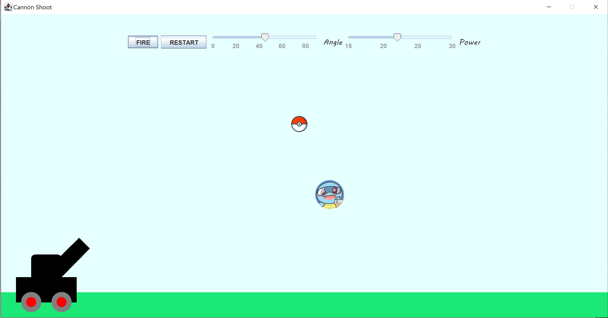

# CannonShoot Game

A simple single-user artillery game in Java

Rules:
- Move angle slider and power slider to adjust cannon angle and ball initial velocity
- Aim the Squirtle and click FIRE button to shoot the poke ball
- If miss the target, readjust slider till hit the target
- RESTART button to generate new target

